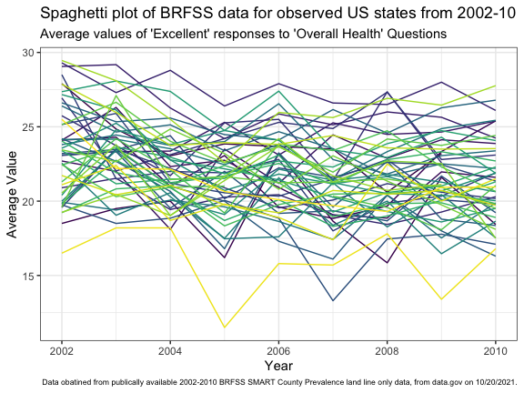
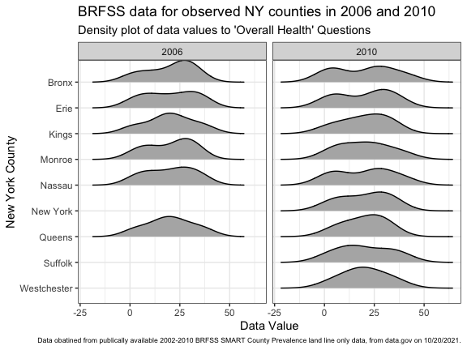
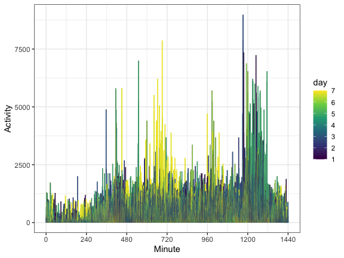
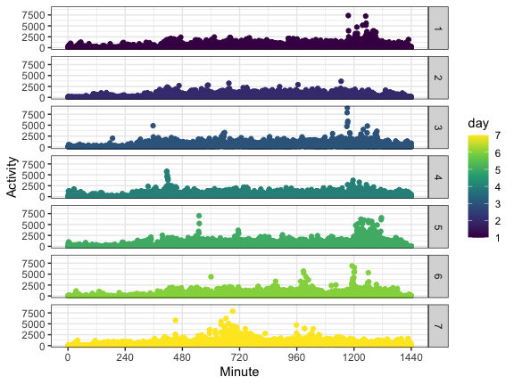

p8105\_hw3\_jae2186
================
jae2186 (Jennifer Estrada)
10/20/2021

``` r
library(tidyverse)
library(p8105.datasets)
library(ggridges)
library(lubridate)

knitr::opts_chunk$set(
    fig.asp = 0.75,
    fig.width = 6,
    message = FALSE,
    warning = FALSE,
    out.width = "90%"
)

theme_set(theme_bw() + theme(plot.caption= element_text(size = 6)))

options(
  ggplot2.continuous.colour = "viridis",
  ggplot2.continuous.fill = "viridis",
  knitr.kable.NA = ""
)

scale_colour_discrete = scale_color_viridis_d
scale_fill_discrete = scale_fill_viridis_d
```

## Problem 1 - Instacart Data

``` r
instacart_df <- force(instacart)

insta_ohod <-
  instacart_df %>% 
  group_by(order_hour_of_day) %>% 
  summarize(n_obs = n(), n_orders = n_distinct(order_id)) %>% 
  arrange(desc(n_orders)) %>% 
  mutate(order_hour_of_day = hms::as_hms(3600 * order_hour_of_day))

insta_dow <-
  instacart_df %>% 
  group_by(order_dow) %>% 
  summarize(n_obs = n(), n_orders = n_distinct(order_id)) %>% 
  arrange(desc(n_orders)) %>% 
  mutate(order_dow = wday(order_dow + 1, label = TRUE, abbr = FALSE))

# The above code for `insta_dow` works on the assumption that weekdays were coded to start on Sunday, which was coded as '0'.

insta_dbo <-
  instacart_df %>% 
  group_by(days_since_prior_order) %>% 
  summarize(n_obs = n(), n_orders = n_distinct(order_id)) %>% 
  arrange(desc(n_orders))

insta_prod_name <- 
  instacart_df %>% 
  select(product_name) %>% 
  count(product_name, name = "prod_count") %>% 
  arrange(desc(prod_count))

insta_aisle <-
  instacart_df %>% 
  select(aisle) %>% 
  count(aisle, name = "aisle_count") %>% 
  arrange(desc(aisle_count))
```

This Instacart dataset has 15 variables describing 131209 individual
orders which included 1384617 items ordered; each order was made by a
unique Instacart user during 2017. The data includes aspects regarding
the timing the order including the time of day at which and day of the
week on which orders were placed. For instance:

-   Orders are typically made in the middle of the day, which is shown
    by the fact that the top 3 hourlong periods for orders were:
    14:00:00 (or 2 pm), 15:00:00 (or 3 pm), and 13:00:00 (or 1 pm).
    (Nearly half-a-day apart from the hour at which the fewest orders
    were placed: 04:00:00, or 4 am.)

-   Orders were placed most frequently on Sunday while the fewest orders
    were placed on Wednesday.

The data also consider characteristics of the order that were unique to
the user (i.e. which number order this was for the shopper and the
number of days since their last order). The data note that:

-   Most the of the orders were placed 30 days (or about 1 month)
    following the previous order. This is in stark contrast to that fact
    that the second most frequent days between orders was 7 days, or 1
    week.

Lastly, the dataset addresses details about the items in the cart,
including the order in which items are put into the virtual carts, the
name of the item, and the location of the item in the grocery store
(i.e. aisle and department). Here are some quick notes on this dataset:

-   The data notes that there are 39123 different products ordered, with
    “Banana” being the most common product ordered while items from the
    fresh vegetables and fresh fruits aisles ordered from the most (with
    a difference of 136 orders compared to the following aisle of
    packaged vegetables fruits which had 71980 fewer orders compared to
    fresh fruits).

-   When answering: <i>how many aisles are there, and which aisles are
    the most items ordered from? </i>

    -   <b>There are 134 aisles and, as previously noted, the top three
        aisles from which items were ordered included:
        -   fresh vegetables (with 150609 orders),
        -   fresh fruits (with 150473 orders), and
        -   packaged vegetables fruits (with 78493 orders). </b>
    -   Of note, these are all produce aisles.

The following includes a plot that shows the number of items ordered in
each aisle, limiting this to aisles with &gt;10000 items ordered.

``` r
instacart_df %>% 
  count(aisle_id) %>% 
  filter(n > 10000) %>% 
  ggplot(aes(x = aisle_id, y = n)) + 
  geom_point() + 
  scale_y_continuous(trans = "log10", labels = scales::label_number()) +
  scale_x_continuous(breaks = seq (0, 175, by = 25)) +
  annotation_logticks(sides = "l") +
  labs(
    title = "Number of items ordered per aisle", 
    subtitle = "Minimum of 10,000 items ordered", 
    x = "Aisle Number",
    y = "Items Ordered (log10 scale)",
    caption = "Data obatined from “The Instacart Online Grocery Shopping Dataset 2017”, https://www.instacart.com/datasets/grocery-shopping-2017 on 10/20/2021.")
```


Below is a table showing the three most popular items in each of the
aisles categorized as “baking ingredients”, “dog food care”, and
“packaged vegetables fruits”, with the number of times each item is
ordered.

``` r
pop_items <-
  instacart_df %>% 
  select(aisle, product_name) %>% 
  filter(aisle == "packaged vegetables fruits"|
           aisle == "baking ingredients" |  
           aisle == "dog food care"
                    ) %>% 
  group_by(aisle, product_name) %>% 
  summarize(n_obs = n()) %>% 
  pivot_wider(names_from = aisle, values_from = n_obs) %>% 
  filter(min_rank(desc(`packaged vegetables fruits`)) <4 |
           min_rank(desc(`baking ingredients`)) <4 |
           min_rank(desc(`dog food care`)) <4) %>% 
  knitr::kable(col.names = c("Product Name", "Baking Ingredients", 
                             "Dog Food Care", 
                             "Packaged Vegetables Fruits"),
               align = "lccc",
               caption = "3 Most Popular Food Items from Instacart for 3 Aisles")

pop_items
```

| Product Name                                  | Baking Ingredients | Dog Food Care | Packaged Vegetables Fruits |
|:----------------------------------------------|:------------------:|:-------------:|:--------------------------:|
| Cane Sugar                                    |        336         |               |                            |
| Light Brown Sugar                             |        499         |               |                            |
| Pure Baking Soda                              |        387         |               |                            |
| Organix Chicken & Brown Rice Recipe           |                    |      28       |                            |
| Small Dog Biscuits                            |                    |      26       |                            |
| Snack Sticks Chicken & Rice Recipe Dog Treats |                    |      30       |                            |
| Organic Baby Spinach                          |                    |               |            9784            |
| Organic Blueberries                           |                    |               |            4966            |
| Organic Raspberries                           |                    |               |            5546            |

3 Most Popular Food Items from Instacart for 3 Aisles

Below is a table showing the mean hour of the day at which Pink Lady
Apples and Coffee Ice Cream are ordered on each day of the week.

``` r
mean_hod <- 
  instacart_df %>% 
  select(product_name, order_dow, order_hour_of_day) %>%
  filter(product_name == "Pink Lady Apples" | 
           product_name == "Coffee Ice Cream") %>% 
  mutate(order_dow = wday(order_dow + 1, label = TRUE, abbr = FALSE)) %>% 
  group_by(product_name, order_dow) %>% 
  summarize(
    mean_hod = mean(order_hour_of_day)
  ) %>% 
  rename("Product Name" = product_name) %>% 
  pivot_wider(names_from = order_dow, values_from = mean_hod) %>% 
  knitr::kable(align = "lccccccc", digits = 1,
               caption = "Mean hour of the day at which 2 items are ordered each day of the week via Instacart")

mean_hod
```

| Product Name     | Sunday | Monday | Tuesday | Wednesday | Thursday | Friday | Saturday |
|:-----------------|:------:|:------:|:-------:|:---------:|:--------:|:------:|:--------:|
| Coffee Ice Cream |  13.8  |  14.3  |  15.4   |   15.3    |   15.2   |  12.3  |   13.8   |
| Pink Lady Apples |  13.4  |  11.4  |  11.7   |   14.2    |   11.6   |  12.8  |   11.9   |

Mean hour of the day at which 2 items are ordered each day of the week
via Instacart

## Problem 2 - BRFSS SMART 2010 Data

This problem uses data made available on data.gov from the Behavioral
Risk Factors Surveillence System (BRFSS) for Selected Metropolitan Area
Risk Trends (SMART) from the years 2002-2010.

``` r
brfss_df <- force(brfss_smart2010) 

brfss_clean <- 
  janitor::clean_names(brfss_df) %>% 
  filter(topic == "Overall Health") %>% 
  filter(response == "Excellent" |
           response == "Very good" |
           response == "Good" |
           response == "Fair" |
           response == "Poor"
           ) %>% 
  mutate(response = forcats::fct_relevel(response, c("Poor", "Fair", "Good", "Very good", "Excellent")))

brfss_02 <-
  filter(brfss_clean, year == 2002) %>% 
  select(contains("location")) %>% 
  group_by(locationabbr, locationdesc) %>% 
  summarize(n_obs = n()) %>% 
  count(locationabbr) %>% 
  arrange(desc(n)) %>% 
  filter(n > 6)

brfss_10 <-
  filter(brfss_clean, year == 2010) %>% 
  select(contains("location")) %>% 
  group_by(locationabbr, locationdesc) %>% 
  summarize(n_obs = n()) %>% 
  count(locationabbr) %>% 
  arrange(desc(n)) %>% 
  filter(n > 6)
```

Given the above data set it was noted that:

-   In 2002 there were 6 states observed at 7 or more locations
    including: PA, MA, NJ, CT, FL, NC.

-   In 2010 there were 14 states observed at 7 or more locations
    including: FL, NJ, TX, CA, MD, NC, NE, WA, MA, NY, OH, CO, PA, SC.

-   Between 2002 and 2010 there were 8 more states with at least 7
    observation sites; not all those originally with 7 or more sites in
    2002 maintained these observation locations as CT dropped down to 5
    locations.

The following 2 plots further describe aspects of the data reported:

``` r
brfss_avg_val <-
  filter(brfss_clean, response == "Excellent") %>% 
  select(year, locationabbr, locationdesc, data_value) %>% 
  group_by(year, locationabbr) %>% 
  mutate(avg_val = mean(data_value)) %>% 
  ggplot(aes(x = year, y = avg_val, color = locationabbr)) +
  geom_line() +
  theme(legend.position = "none") +
  labs(
    title = "Spaghetti plot of BRFSS data for observed US states from 2002-10", 
    subtitle = "Average values of 'Excellent' responses to 'Overall Health' Questions", 
    x = "Year",
    y = "Average Value",
    caption = "Data obatined from publically available 2002-2010 BRFSS SMART County Prevalence land line only data, from data.gov on 10/20/2021.")

brfss_avg_val
```



``` r
brfss_ny <-
  filter(brfss_clean, locationabbr == "NY" & year == "2006" |
           locationabbr == "NY" &
           year == "2010") %>% 
  select(year, locationdesc, response, data_value) %>% 
  group_by(year, locationdesc) %>% 
  ggplot(aes(x = data_value, y = locationdesc)) + 
  geom_density_ridges(scale = .85) +
  facet_grid(. ~ year) +
  labs(
    title = "BRFSS data for observed NY counties in 2006 and 2010", 
    subtitle = "Density plot of data values to 'Overall Health' Questions", 
    x = "Data Value",
    y = "New York County",
    caption = "Data obatined from publically available 2002-2010 BRFSS SMART County Prevalence land line only data, from data.gov on 10/20/2021.") +
  scale_y_discrete(
    labels = c("Westchester", "Suffolk", "Queens", "New York", 
               "Nassau","Monroe", "Kings", "Erie", "Bronx")
  )
  
brfss_ny
```



## Problem 3 - Accelerometer Data

``` r
accel_df <-
  read_csv("./data/accel_data.csv") %>% 
  janitor::clean_names() %>% 
  mutate(
    day = recode(day, `Monday` = "1", `Tuesday` = "2", `Wednesday` = "3", `Thursday` = "4",
                 `Friday` = "5", `Saturday` = "6", `Sunday` = "7"),
    day = parse_number(day),
    week_v_end = ifelse(day <= 5, 1, 0)
    ) %>% 
  relocate(week, day_id, day, week_v_end)
```

The dataset consists of acceleramator activity data over the course of 5
weeks, for a total of 35 days, which was collected from a 63 year-old
male admitted to Columbia’s Center for Advanced Cardiac Care. For each
day of observation it is noted what day of the week it was, including
information from 25 weekdays. Finally, for each day there are 1440
activities reported, which account for each minute in the day, yielding
50400 accelerometer observations for physical activity.

``` r
accel_table <-
  accel_df %>% 
  group_by(day_id, week_v_end) %>% 
  select(-day, -week) %>% 
  mutate(sum = rowSums(across(activity_1:activity_1440))) %>% 
  select(day_id, week_v_end, sum) %>% 
  pivot_wider(names_from = "week_v_end", values_from = "sum") %>%
  knitr::kable(col.names = c("Observation Day (Day ID)", "Weekday","Weekend"),
               align = "ccc",
               digits = 0,
               caption = "Amount of activity per given observational day")

accel_table
```

| Observation Day (Day ID) | Weekday | Weekend |
|:------------------------:|:-------:|:-------:|
|            1             | 480543  |         |
|            2             |  78828  |         |
|            3             |         | 376254  |
|            4             |         | 631105  |
|            5             | 355924  |         |
|            6             | 307094  |         |
|            7             | 340115  |         |
|            8             | 568839  |         |
|            9             | 295431  |         |
|            10            |         | 607175  |
|            11            |         | 422018  |
|            12            | 474048  |         |
|            13            | 423245  |         |
|            14            | 440962  |         |
|            15            | 467420  |         |
|            16            | 685910  |         |
|            17            |         | 382928  |
|            18            |         | 467052  |
|            19            | 371230  |         |
|            20            | 381507  |         |
|            21            | 468869  |         |
|            22            | 154049  |         |
|            23            | 409450  |         |
|            24            |         |  1440   |
|            25            |         | 260617  |
|            26            | 340291  |         |
|            27            | 319568  |         |
|            28            | 434460  |         |
|            29            | 620860  |         |
|            30            | 389080  |         |
|            31            |         |  1440   |
|            32            |         | 138421  |
|            33            | 549658  |         |
|            34            | 367824  |         |
|            35            | 445366  |         |

Amount of activity per given observational day

When looking at the above table noting the amount of activity recorded
for a given observational day, the most notable feature are the 2
weekends in which the patient had days recording the minimal amount of
activity (i.e. a default of 1440, or 1 baseline activity measured every
minute). It appears that the patient’s activity is evenly distributed
between weekends and weekdays but generally hovers between 300000 and
500000.

``` r
accel_plot <-
  accel_df %>% 
  pivot_longer(cols = starts_with("activity_"), 
               names_prefix = "activity_",
               names_to = "minute", 
               values_to = "activity") %>% 
  mutate(minute = parse_number(minute)) %>% 
  ggplot(aes(y = activity, x = minute, color = day)) + 
  geom_line() + 
  labs(x = "Minute", y = "Activity") +
  scale_x_continuous(breaks = seq(from = 0, to = 1440, by = 240))

accel_plot
```



``` r
accel_facet <-
  accel_df %>% 
  pivot_longer(cols = starts_with("activity_"), 
               names_prefix = "activity_",
               names_to = "minute", 
               values_to = "activity") %>% 
  mutate(minute = parse_number(minute)) %>% 
  ggplot(aes(y = activity, x = minute, color = day)) + 
  geom_point() + 
  labs(x = "Minute", y = "Activity") +
  scale_x_continuous(breaks = seq(from = 0, to = 1440, by = 240)) +
  facet_grid(day ~ .) 

accel_facet
```



Based on the first graph it is not readily apparent if there are any
patterns between the different days of the weeks (in which Monday is
noted to be day 1 and Sunday day 7). However, once all of the days are
separated it is noted tat there are moments of more activity later in
teh day during the majority of the week while most activity on Sunday is
limited to the middle of the day (bottom graph). Furthermore, there are
moments of increased activity earlier in the day during the week but is
also has a later start on Sunday.
