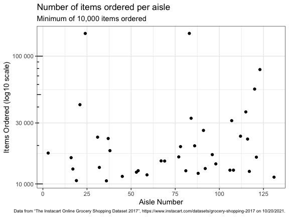

p8105\_hw3\_jae2186
================
jae2186 (Jennifer Estrada)
10/20/2021

``` r
library(tidyverse)
library(p8105.datasets)
library(ggridges)
library(lubridate)

knitr::opts_chunk$set(
    fig.asp = 0.75,
    fig.width = 6,
    message = FALSE,
    warning = FALSE,
    out.width = "90%"
)

theme_set(theme_bw() + theme(legend.position = "bottom", 
                             plot.caption= element_text(size = 6)))

options(
  ggplot2.continuous.colour = "viridis",
  ggplot2.continuous.fill = "viridis"
)

scale_colour_discrete = scale_color_viridis_d
scale_fill_discrete = scale_fill_viridis_d
```

## Problem 1 - Instacart Data

``` r
instacart_df <- force(instacart)

insta_ohod <-
  instacart_df %>% 
  group_by(order_hour_of_day) %>% 
  summarize(n_obs = n(), n_orders = n_distinct(order_id)) %>% 
  arrange(desc(n_orders)) %>% 
  mutate(order_hour_of_day = hms::as_hms(3600 * order_hour_of_day))

insta_dow <-
  instacart_df %>% 
  group_by(order_dow) %>% 
  summarize(n_obs = n(), n_orders = n_distinct(order_id)) %>% 
  arrange(desc(n_orders)) %>% 
  mutate(order_dow = wday(order_dow + 1, label = TRUE, abbr = FALSE))

# The above code for `insta_dow` works on the assumption that weekdays were coded to start on Sunday, which was coded as '0'.

insta_dbo <-
  instacart_df %>% 
  group_by(days_since_prior_order) %>% 
  summarize(n_obs = n(), n_orders = n_distinct(order_id)) %>% 
  arrange(desc(n_orders))

insta_prod_name <- 
  instacart_df %>% 
  select(product_name) %>% 
  count(product_name, name = "prod_count") %>% 
  arrange(desc(prod_count))

insta_aisle <-
  instacart_df %>% 
  select(aisle) %>% 
  count(aisle, name = "aisle_count") %>% 
  arrange(desc(aisle_count))
```

This Instacart dataset has 15 variables describing 131209 individual
orders which included 1384617 items ordered; each order was made by a
unique Instacart user during 2017. The data includes aspects regarding
the timing the order including the time of day at which and day of the
week on which orders were placed. For instance:

-   Orders are typically made in the middle of the day, which is shown
    by the fact that the top 3 hourlong periods for orders were:
    14:00:00 (or 2 pm), 15:00:00 (or 3 pm), and 13:00:00 (or 1 pm).
    (Nearly half-a-day apart from the hour at which the fewest orders
    were placed: 04:00:00, or 4 am.)

-   Orders were placed most frequently on Sunday while the fewest orders
    were placed on Wednesday.

The data also consider characteristics of the order that were unique to
the user (i.e. which number order this was for the shopper and the
number of days since their last order). The data note that:

-   Most the of the orders were placed 30 days (or about 1 month)
    following the previous order. This is in stark contrast to that fact
    that the second most frequent days between orders was 7 days, or 1
    week.

Lastly, the dataset addresses details about the items in the cart,
including the order in which items are put into the virtual carts, the
name of the item, and the location of the item in the grocery store
(i.e. aisle and department). Here are some quick notes on this dataset:

-   The data notes that there are 39123 different products ordered, with
    “Banana” being the most common product ordered while items from the
    fresh vegetables and fresh fruits aisles ordered from the most (with
    a difference of 136 orders compared to the following aisle of
    packaged vegetables fruits which had 71980 fewer orders compared to
    fresh fruits).

-   When answering: <i>how many aisles are there, and which aisles are
    the most items ordered from? </i>

    -   <b>There are 134 aisles and, as previously noted, the top three
        aisles from which items were ordered included:
        -   fresh vegetables (with 150609 orders),
        -   fresh fruits (with 150473 orders), and
        -   packaged vegetables fruits (with 78493 orders).
    -   Of note, these are all produce aisles. </b>

The following includes a plot that shows the number of items ordered in
each aisle, limiting this to aisles with &gt;10000 items ordered.

``` r
instacart_df %>% 
  count(aisle_id) %>% 
  filter(n > 10000) %>% 
  ggplot(aes(x = aisle_id, y = n)) + 
  geom_point() + 
  scale_y_continuous(trans = "log10", labels = scales::label_number()) +
  scale_x_continuous(breaks = seq (0, 175, by = 25)) +
  annotation_logticks(sides = "l") +
  labs(
    title = "Number of items ordered per aisle", 
    subtitle = "Minimum of 10,000 items ordered", 
    x = "Aisle Number",
    y = "Items Ordered (log10 scale)",
    caption = "Data obatined from “The Instacart Online Grocery Shopping Dataset 2017”, https://www.instacart.com/datasets/grocery-shopping-2017 on 10/20/2021.")
```


